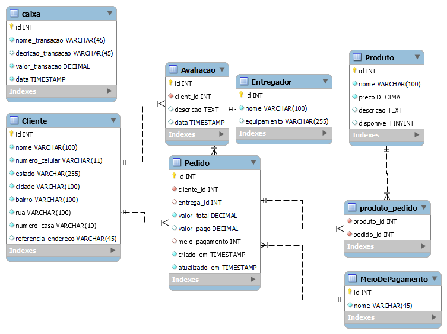

# SpaceFood, Sistema de Delivery - Banco de Dados

Projeto desenvolvido para a disciplina de **Modelagem de Banco de Dados** do 1º Semestre.

## Descrição do Mini-Mundo

Este banco de dados modela um **sistema de delivery** que gerencia:
- **Clientes**: cadastro com informações de contato e endereço
- **Produtos**: cardápio com preços e disponibilidade
- **Pedidos**: registro de compras dos clientes
- **Entregadores**: equipe de entrega com seus veículos
- **Avaliações**: feedback dos clientes
- **Meios de Pagamento**: formas de pagamento aceitas
- **Caixa**: controle financeiro de entradas e saídas

## Diagrama Entidade-Relacionamento



## Estrutura do Projeto

```
├── script_criação.sql      # DDL - Criação do banco e tabelas
├── script_insert.sql       # DML - Inserção de dados (INSERT)
├── script_select.sql       # DML - Consultas (SELECT)
├── script_update_delete.sql # DML - Atualização e exclusão (UPDATE/DELETE)
├── modelo_refatorado.png   # Diagrama ER do banco
└── README.md               # Documentação do projeto
```

## Pré-requisitos

- MySQL Server 8.0 ou superior
- MySQL Workbench (recomendado) ou outro cliente MySQL

## Instruções de Execução

### 1. Criar o Banco de Dados
Execute o script de criação para criar o schema e todas as tabelas:
```sql
SOURCE script_criação.sql;
```
Ou abra o arquivo `script_criação.sql` no MySQL Workbench e execute.

### 2. Povoar as Tabelas
Execute o script de inserção para adicionar dados de exemplo:
```sql
SOURCE script_insert.sql;
```

### 3. Executar Consultas
Execute o script de consultas para visualizar os dados:
```sql
SOURCE script_select.sql;
```

### 4. Testar Atualizações e Exclusões
Execute o script de UPDATE/DELETE para manipular os dados:
```sql
SOURCE script_update_delete.sql;
```

## Scripts SQL

### INSERT (`script_insert.sql`)
Povoamento das tabelas com dados fictícios:
- 5 Clientes
- 7 Produtos
- 4 Entregadores
- 5 Meios de Pagamento
- 6 Pedidos
- 13 itens em Pedidos (produto_pedido)
- 4 Avaliações
- 7 Transações no Caixa

### SELECT (`script_select.sql`)
Consultas demonstrando diferentes recursos SQL:
1. **Listagem de clientes** - `ORDER BY`
2. **Filtro de produtos** - `WHERE`, `AND`, `ORDER BY`
3. **Pedidos recentes com JOIN** - `INNER JOIN`, `LEFT JOIN`, `ORDER BY`, `LIMIT`
4. **Relatório completo** - Múltiplos `JOIN`, `GROUP_CONCAT`, `GROUP BY`
5. **Resumo de vendas** - Funções de agregação (`SUM`, `COUNT`, `AVG`)
6. **Avaliações com clientes** - `INNER JOIN`
7. **Saldo do caixa** - `CASE`, `SUM`, `ABS`

### UPDATE/DELETE (`script_update_delete.sql`)
Comandos de manipulação:

**UPDATE (5 comandos):**
1. Atualizar preço de produto
2. Alterar disponibilidade de produto
3. Confirmar pagamento de pedido
4. Atualizar dados de cliente
5. Atualizar equipamento de entregador

**DELETE (3 comandos):**
1. Remover avaliação
2. Remover transação do caixa
3. Remover meio de pagamento não utilizado

## Tabelas do Banco

| Tabela | Descrição |
|--------|-----------|
| Cliente | Dados dos clientes e endereço de entrega |
| Produto | Cardápio de produtos disponíveis |
| Entregador | Equipe de entrega |
| MeioDePagamento | Formas de pagamento aceitas |
| Pedido | Registro de pedidos realizados |
| produto_pedido | Relacionamento N:N entre Produto e Pedido |
| Avaliacao | Feedback dos clientes |
| caixa | Controle financeiro |

## Tecnologias Utilizadas

- **MySQL 8.0** - Sistema de Gerenciamento de Banco de Dados
- **MySQL Workbench** - Ferramenta de modelagem e administração

## Autor

Desenvolvido como atividade avaliativa da disciplina de Modelagem de Banco de Dados.

---

*Projeto acadêmico - 1º Semestre*
